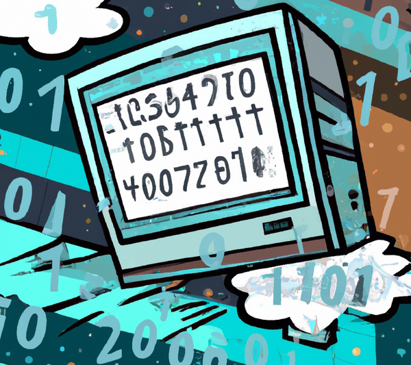

# Hex Editor

## What it is

This is a hex editor made for the web. 

You can see it in action [here](https://chipper-seahorse-3889b8.netlify.app/). It is still
a work in progress and is missing a lot of features currently.

It allows you to open a file on your computer and view its contents in a hex editor.
There is no server side stuff going on - your file is never uploaded or transferred to 
any server. Everything happens in your browser.

## Things to fix and features to add:

- Currently the entire file is loaded at once. This is going to change so that only
    pieces of the file are loaded when needed.
- You can't actually edit anything yet.
- Should have an undo function.
- You will be able to "download" the edited file - you aren't actually downloading anything 
    though since nothing is actually happening on a server. There is no serverside.
    